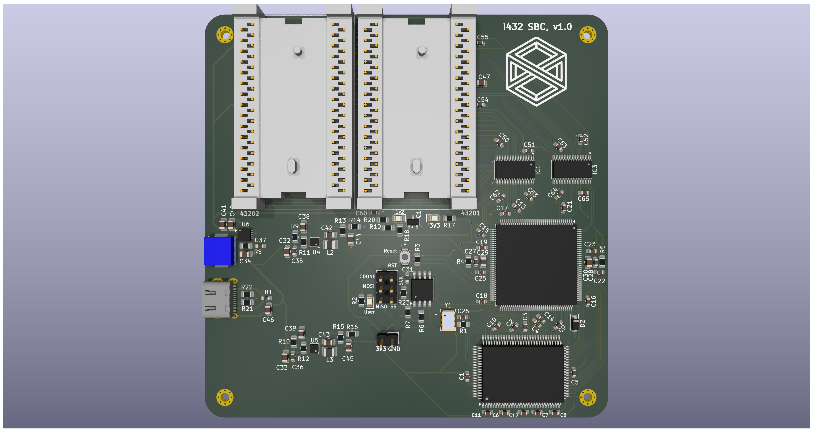

# System board for Intel APX 432 GDP
FPGA-based single board computer to run iAPX 432 GDP

## Board

Full schematics in [pdf format](./images/schematic.pdf)

Here is shown only FPGA part of the board:

Archive with gerber files and drill locations could be found [here](./pcb/manufacturing.zip)

Bill of material in [CSV format](./pcb/bom.csv)

| Reference                                                                                                                                                                      | Qty | Value                   | Mouser Part Number   |
|--------------------------------------------------------------------------------------------------------------------------------------------------------------------------------|-----|-------------------------|----------------------|
| Y1                                                                                                                                                                             | 1   | 250Mhz                  | 972-XLH536250000000I |
| U1                                                                                                                                                                             | 1   | SRAM                    | 870-61LPS12836A5TQL  |
| U2                                                                                                                                                                             | 1   | ICE40                   | 842-ICE40HX4K-TQ144  |
| FB1                                                                                                                                                                            | 1   | Ferrite_Bead            | 81-BLM18BD152SH1D    |
| D1                                                                                                                                                                             | 1   | Red                     | 710-150080RS75000    |
| D3,D4                                                                                                                                                                          | 2   | Green                   | 710-150080GS75000    |
| J1                                                                                                                                                                             | 1   | Type-C                  | 656-DX07S016JA1R1500 |
| L1                                                                                                                                                                             | 1   | 1u5, 5A                 | 652-SRP6530A-1R5M    |
| L2,L3                                                                                                                                                                          | 2   | 0u68, 5.5A              | 652-SRP2512-R68M     |
| J3                                                                                                                                                                             | 1   | Power                   | 649-67997-200HLF     |
| J2                                                                                                                                                                             | 1   | FPGA programming / UART | 649-1012938190604BLF |
| SW1                                                                                                                                                                            | 1   | FPGA Reset              | 640-SWT0010015016SSA |
| Q1                                                                                                                                                                             | 1   | MMBT3904                | 637-MMBT3904         |
| D2                                                                                                                                                                             | 1   | 1N5819                  | 621-1N5819HW-F       |
| R11,R12,R13,R14,R19                                                                                                                                                            | 5   | 100k                    | 603-RT0805DRE07100KL |
| R23                                                                                                                                                                            | 1   | 470R                    | 603-RT0805BRD07470RL |
| R21,R22                                                                                                                                                                        | 2   | 5k1                     | 603-RC0805FR-075K1L  |
| R2,R18                                                                                                                                                                         | 2   | 4k7                     | 603-RC0805FR-074K7L  |
| R16                                                                                                                                                                            | 1   | 34k8                    | 603-RC0805FR-0734K8L |
| R17,R20                                                                                                                                                                        | 2   | 2k2                     | 603-RC0805FR-072K2L  |
| R15                                                                                                                                                                            | 1   | 158k                    | 603-RC0805FR-07158KL |
| R1                                                                                                                                                                             | 1   | 22R                     | 603-RC0805FR-1322RL  |
| C43                                                                                                                                                                            | 1   | 33p                     | 603-CC805KRNPO9BN330 |
| C42                                                                                                                                                                            | 1   | 22p                     | 603-CC805JRNPO9BN220 |
| R9,R10                                                                                                                                                                         | 2   | 10                      | 603-AF0805FR-0710RL  |
| R4,R5,R8                                                                                                                                                                       | 3   | 100R                    | 603-AC0805FR-13100RL |
| R3,R6,R7                                                                                                                                                                       | 3   | 10k                     | 603-AA0805FR-0710KL  |
| U6                                                                                                                                                                             | 1   | TPS63002                | 595-TPS63002DRCR     |
| IC3                                                                                                                                                                            | 1   | Control signals         | 595-LVC16T245DGVRG4  |
| IC1                                                                                                                                                                            | 1   | Address/data bus        | 595-LVC16T245DGVRG4  |
| U4,U5                                                                                                                                                                          | 2   | LX7167ACLD-TR           | 494-LX7167ACLD-TR    |
| U3                                                                                                                                                                             | 1   | Bitstream flash         | 454-W25Q16JVSSIQ     |
| C38,C39,C46,C47                                                                                                                                                                | 4   | 1u                      | 187-CL21B105KPFNNNE  |
| C29,C30,C32,C33,C44,C45                                                                                                                                                        | 6   | 22u                     | 187-CL21A226MAYNNNE  |
| C34,C40,C41                                                                                                                                                                    | 3   | 10u                     | 187-CL21A106KQFNNNG  |
| C1,C2,C3,C4,C5,C6,C7,C8,C9,C10,C11,C12,C13,C14,C15,C16,C17,C18,C19,C21,C22,C23,C25,C26,C27,C28,C31,C35,C36,C37,C50,C51,C52,C53,C54,C55,C56,C57,C58,C59,C60,C61,C62,C63,C64,C65 | 46  | 100n                    | 187-CL10B104KB8NNNC  |
| U8                                                                                                                                                                             | 1   | 43202                   |                      |
| U7                                                                                                                                                                             | 1   | 43201                   |                      |

## FPGA bitstream

Here is compiled [bitsream](./gateware/build/iapx432-sbc.bin).
You can flash it to memory chip via SPI programmer (there is 6-pin header for that).
